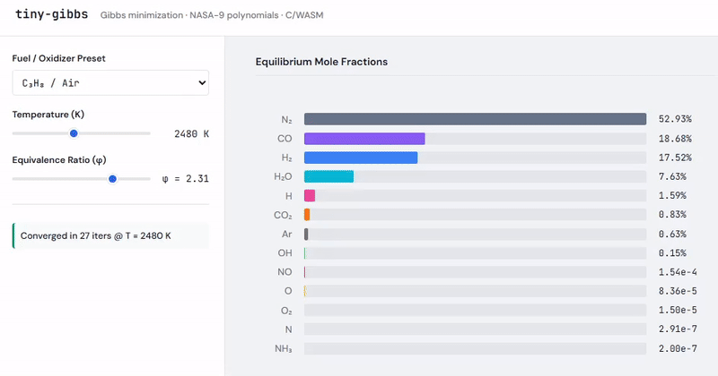

# tiny-gibbs



A lightweight, high-performance chemical equilibrium solver written in C and compiled to WebAssembly.

This project computes the equilibrium composition of ideal gas mixtures using direct Gibbs free energy minimization (the RAND method). It utilizes a damped Newton-Raphson approach to solve the Karush-Kuhn-Tucker (KKT) conditions and relies on NASA-9 polynomials for highly accurate thermodynamic properties.

This is a C/WASM port of my original Python implementation available at [marciorvneto/chem-eq](https://github.com/marciorvneto/chem-eq).

## Features & Scope

- **Bare-Metal C / WASM:** Zero external dependencies. Everything here is tailor-made from scratch: it uses a custom arena allocator and my own `stb`-style linear algebra single-header library, [tinyla.h](https://github.com/marciorvneto/tinyla), for maximum performance in the browser.
- **Direct Gibbs Minimization:** Avoids the need to specify independent reaction sets.
- **NASA-9 Thermodynamics:** Accurate specific heat, enthalpy, and entropy calculations across wide temperature ranges.
- **Warm-Start Capable:** State is preserved between runs, allowing temperature or composition sweeps to converge in just 1–2 iterations.
- **Gas-Phase Combustion:** Currently, the solver only supports ideal gas phase calculations. It is tailored specifically for combustion applications, relying on NASA's 9-coefficient thermodynamic datasets. By the way, if you'd like to take a look at the complete NASA-9 Thermodynamics database, be sure to refer to NASA's amazing [CEA](https://github.com/nasa/CEA) repository.

## Build Instructions

Because this project relies on `tinyla` as a submodule, make sure to initialize it when cloning:

```bash
# Clone the repo with submodules
git clone --recursive https://github.com/marciorvneto/tiny-gibbs.git
cd tiny-gibbs

# Or, if you already cloned it without submodules, run:
# git submodule update --init

```

To compile the project, simply run `make`. The `Makefile` relies on standard `gcc`/`clang` for the native build and `emcc` (Emscripten) for the WebAssembly build.

```bash
make

```

This will generate:

- `out/main`: The native C executable for local debugging.
- `docs/main.js` & `docs/main.wasm`: The compiled WebAssembly bundle (with the NASA database embedded) ready to be served alongside your HTML.

## Mathematical Formulation

_(Note: A complete derivation of the KKT conditions and the resulting Jacobian block matrix, formulated using Fréchet differentials, will be added here soon.)_

## Interested in the theory?

If you'd like to dive deeper into the underlying thermodynamics and numerical methods, I wrote a paper on Gibbs minimization a while ago. Please feel free to refer to it:

[Chemical and phase equilibrium calculations by Gibbs energy minimization using deterministic methods based on globally convergent branch and bound algorithms](https://www.sciencedirect.com/science/article/abs/pii/S037838121730211X)

## License

MIT
